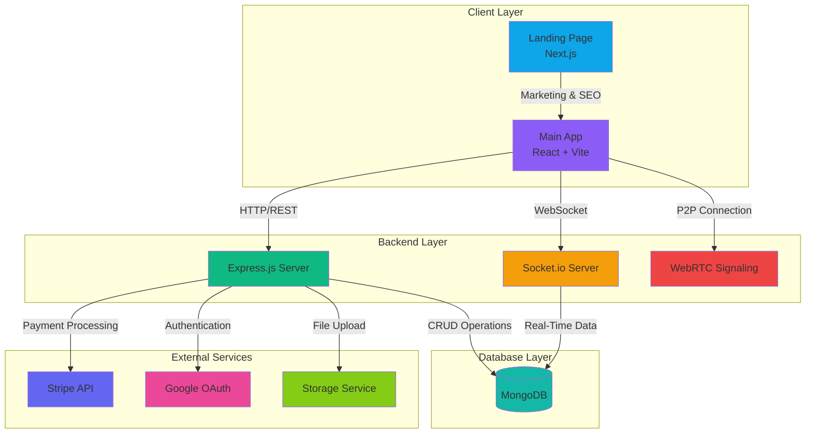
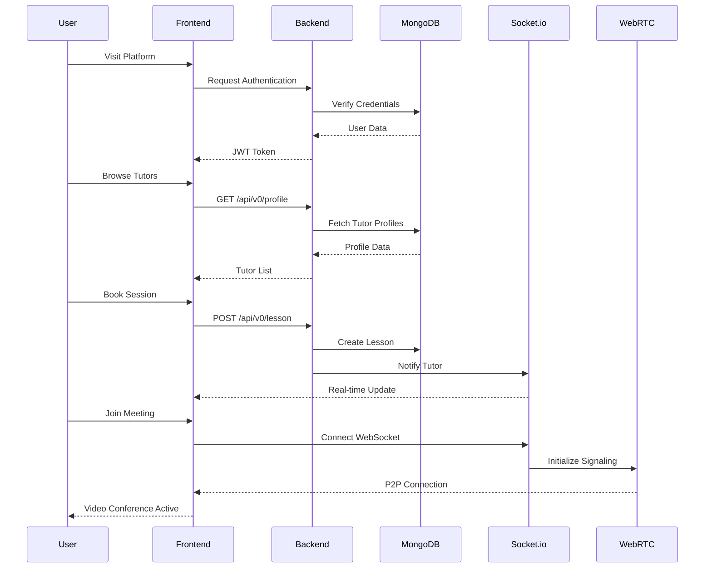
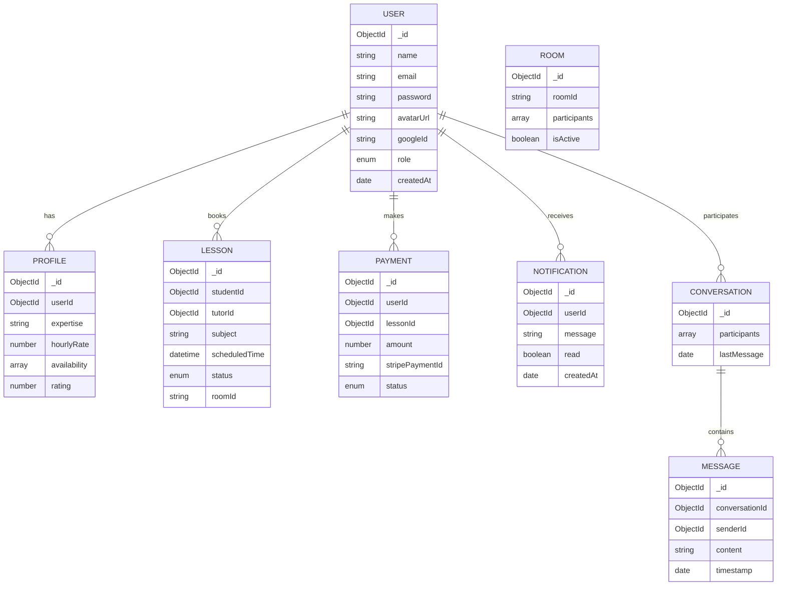
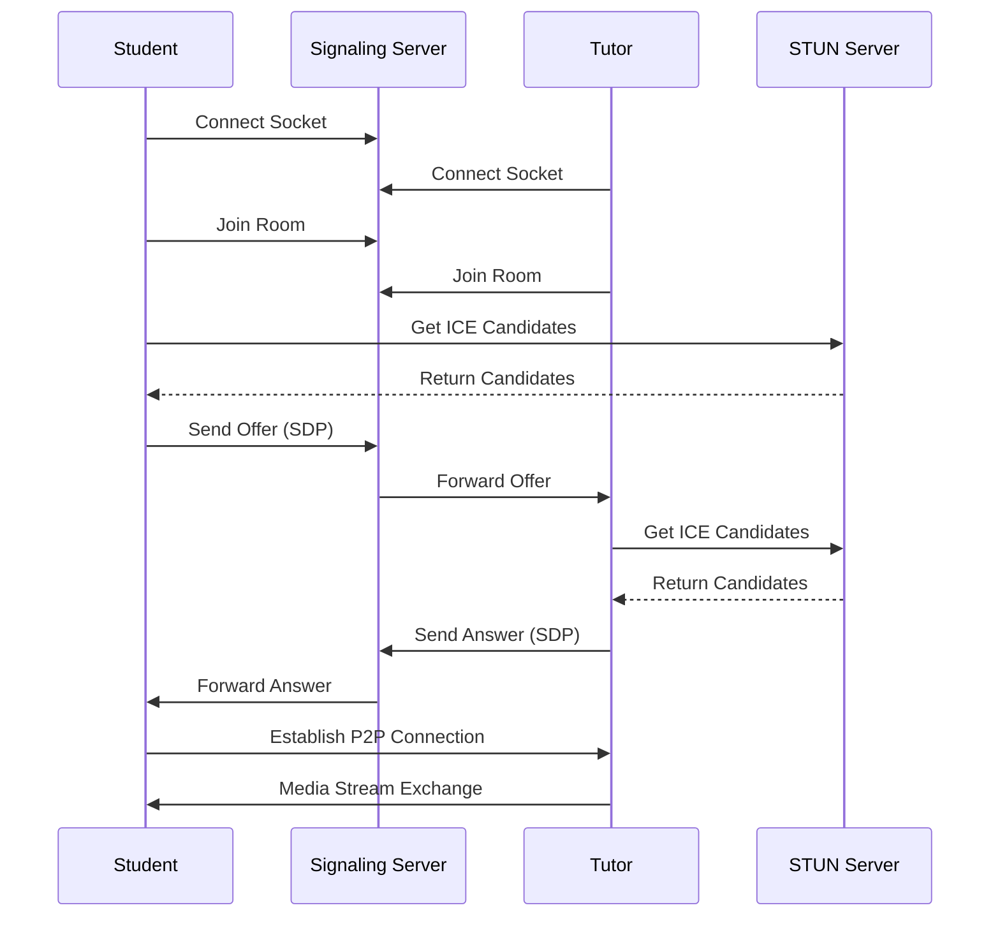
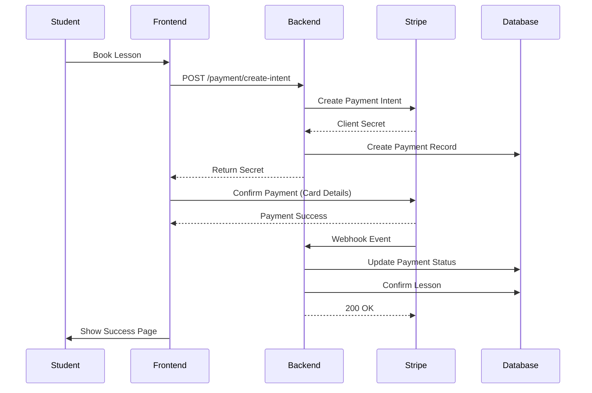

<div align="center">

# 🎓 MeshSpire-Core

### _Empowering Education Through Real-Time Collaboration_

[](https://www.typescriptlang.org/)
[](https://reactjs.org/)
[](https://nextjs.org/)
[](https://nodejs.org/)
[](https://www.mongodb.com/)
[](https://socket.io/)

```ascii
   __  ___         __    _____       _
  /  |/  /__ ____ / /__ / ___/__  __(_)_______
 / /|_/ / -_|_-</ _ \_\ \/ _ \/ / / / __/ -_)
/_/  /_/\__/___/_//_/___/ .__/\_,_/_/_/  \__/
                       /_/
```

[Features](#-key-features) • [Architecture](#-architecture) • [Getting Started](#-getting-started) • [API Documentation](#-api-documentation) • [Contributing](#-contributing)

</div>

---

## 📖 Table of Contents

- [Overview](#-overview)
- [Key Features](#-key-features)
- [Architecture](#-architecture)
- [Technology Stack](#-technology-stack)
- [Project Structure](#-project-structure)
- [Getting Started](#-getting-started)
- [API Documentation](#-api-documentation)
- [WebRTC & Real-Time Communication](#-webrtc--real-time-communication)
- [Payment Integration](#-payment-integration)
- [Contributing](#-contributing)
- [Team](#-team)
- [License](#-license)

---

## 🌟 Overview

**MeshSpire-Core** is a comprehensive online tutoring platform that connects students with tutors through real-time video conferencing, interactive chat, and seamless scheduling. Built with modern web technologies, it provides a robust ecosystem for virtual education.

### 🎯 Mission

To democratize education by providing a seamless, accessible, and feature-rich platform that bridges the gap between students seeking knowledge and tutors ready to share their expertise.

### ✨ What Makes MeshSpire Special?

- **Real-Time Video Conferencing**: WebRTC-powered peer-to-peer video communication
- **Interactive Whiteboard**: Collaborative learning space during sessions
- **Smart Scheduling**: Calendar integration with automated reminders
- **Secure Payments**: Stripe integration for seamless transactions
- **Live Chat**: Real-time messaging system for instant communication
- **Profile Management**: Rich user profiles for both students and tutors

---

## 🚀 Key Features

### For Students 👨‍🎓

- 🔍 **Browse Tutors**: Search and filter tutors by subject, rating, and availability
- 📅 **Book Sessions**: Schedule lessons with integrated calendar system
- 💬 **Real-Time Chat**: Communicate with tutors before and after sessions
- 🎥 **HD Video Calls**: High-quality video conferencing experience
- 💳 **Secure Payments**: Pay for sessions securely via Stripe
- 📊 **Progress Tracking**: Monitor your learning journey
- 🔔 **Smart Notifications**: Get reminders for upcoming sessions

### For Tutors 👨‍🏫

- 📝 **Profile Showcase**: Create detailed tutor profiles with expertise and rates
- 🗓️ **Availability Management**: Set your schedule and availability
- 💰 **Earnings Dashboard**: Track your income and session history
- 👥 **Student Management**: Manage your student roster
- 📈 **Analytics**: View session statistics and ratings
- 🔔 **Meeting Reminders**: Automated notifications for upcoming sessions

### Platform Features 🌐

- 🔐 **Multi-Auth System**: Email/password and Google OAuth integration
- 🎭 **Role-Based Access**: Separate dashboards for students and tutors
- 📱 **Responsive Design**: Seamless experience across all devices
- 🌙 **Dark Mode Support**: Eye-friendly interface options
- 🔒 **Secure Backend**: JWT authentication with HTTP-only cookies
- ⚡ **Real-Time Updates**: Socket.io powered live updates

---

## 🏗️ Architecture

### System Architecture Diagram



### Application Flow



### Database Schema



---

## 💻 Technology Stack

### Frontend

| Technology           | Purpose                | Version  |
| -------------------- | ---------------------- | -------- |
| **React 19**         | UI Framework           | 19.1.1   |
| **TypeScript**       | Type Safety            | ~5.8.3   |
| **Vite**             | Build Tool             | Latest   |
| **Next.js 15**       | Landing Page Framework | 15.5.4   |
| **Tailwind CSS**     | Styling                | 4.1.13   |
| **Material-UI**      | Component Library      | 7.3.3    |
| **Framer Motion**    | Animations             | 12.23.22 |
| **React Router**     | Routing                | 7.9.3    |
| **Socket.io Client** | WebSocket Client       | 4.8.1    |
| **Simple Peer**      | WebRTC                 | 9.11.1   |
| **Axios**            | HTTP Client            | 1.13.2   |
| **Stripe**           | Payment Integration    | 5.4.1    |

### Backend

| Technology      | Purpose             | Version |
| --------------- | ------------------- | ------- |
| **Node.js**     | Runtime Environment | Latest  |
| **Express**     | Web Framework       | 5.1.0   |
| **TypeScript**  | Type Safety         | 5.9.3   |
| **MongoDB**     | Database            | Latest  |
| **Mongoose**    | ODM                 | 8.18.2  |
| **Socket.io**   | WebSocket Server    | 4.8.1   |
| **Passport.js** | Authentication      | 0.7.0   |
| **JWT**         | Token Management    | 9.0.2   |
| **bcrypt**      | Password Hashing    | 3.0.2   |
| **Stripe**      | Payment Processing  | 20.0.0  |
| **Multer**      | File Upload         | 2.0.2   |
| **Helmet**      | Security            | 8.1.0   |
| **Zod**         | Schema Validation   | 4.1.11  |

### DevOps & Tools

- **Git & GitHub**: Version Control
- **ESLint**: Code Linting
- **dotenv**: Environment Variables
- **Vercel**: Frontend Deployment
- **PM2**: Process Management (Production)

---

## 📁 Project Structure

```
MeshSpire-Core/
│
├── 📱 frontend/                    # Main React Application
│   ├── src/
│   │   ├── api/                   # API Integration Layer
│   │   │   ├── chat.ts
│   │   │   ├── notification.ts
│   │   │   └── payment.ts
│   │   ├── Components/            # Reusable Components
│   │   │   ├── Calendar.tsx
│   │   │   ├── LessonCarousel.tsx
│   │   │   ├── MeetComp.tsx
│   │   │   ├── MeetingChat.tsx
│   │   │   ├── Navbar.tsx
│   │   │   ├── NotificationDropdown.tsx
│   │   │   ├── PrivateRoute.tsx
│   │   │   └── Sidebar.tsx
│   │   ├── Context/               # React Context
│   │   │   └── AuthContext.tsx
│   │   ├── hooks/                 # Custom Hooks
│   │   │   ├── SendMyVideo.ts
│   │   │   └── useOutsideClick.ts
│   │   ├── Pages/                 # Page Components
│   │   │   ├── Auth.tsx
│   │   │   ├── Chat.tsx
│   │   │   ├── Dashboard.tsx
│   │   │   ├── Meeting.tsx
│   │   │   ├── Profile.tsx
│   │   │   ├── TutorDashboard.tsx
│   │   │   └── ...
│   │   ├── providers/             # Context Providers
│   │   │   ├── PeerProvider.tsx
│   │   │   └── SocketProvider.tsx
│   │   ├── App.tsx               # Root Component
│   │   └── main.tsx              # Entry Point
│   ├── package.json
│   └── vite.config.ts
│
├── 🖥️ backend/                     # Node.js Express Server
│   ├── src/
│   │   ├── config/                # Configuration
│   │   │   └── passport.config.ts
│   │   ├── controller/            # Route Controllers
│   │   │   ├── avatarUpload.ts
│   │   │   ├── chat.controller.ts
│   │   │   ├── lesson.controller.ts
│   │   │   ├── notification.controller.ts
│   │   │   ├── payment.controller.ts
│   │   │   ├── profile.controller.ts
│   │   │   ├── room.controller.ts
│   │   │   └── user.controller.ts
│   │   ├── manager/               # Business Logic
│   │   │   └── room.manager.ts
│   │   ├── middleware/            # Express Middleware
│   │   │   └── auth.middleware.ts
│   │   ├── models/                # Mongoose Models
│   │   │   ├── conversation.model.ts
│   │   │   ├── LessonModel.ts
│   │   │   ├── message.model.ts
│   │   │   ├── notification.model.ts
│   │   │   ├── payment.model.ts
│   │   │   ├── profile.model.ts
│   │   │   ├── room.model.ts
│   │   │   └── user.model.ts
│   │   ├── routes/                # API Routes
│   │   │   ├── chat.route.ts
│   │   │   ├── lesson.route.ts
│   │   │   ├── notification.route.ts
│   │   │   ├── payment.routes.ts
│   │   │   ├── profile.route.ts
│   │   │   ├── room.route.ts
│   │   │   └── user.route.ts
│   │   ├── utils/                 # Utility Functions
│   │   │   └── meetingNotifications.ts
│   │   └── server.ts              # Server Entry Point
│   ├── package.json
│   └── tsconfig.json
│
├── 🌐 landing/                     # Next.js Landing Page
│   ├── src/
│   │   ├── app/                   # Next.js App Router
│   │   │   ├── layout.tsx
│   │   │   ├── page.tsx
│   │   │   └── globals.css
│   │   ├── components/            # Landing Components
│   │   │   ├── sections/
│   │   │   └── ui/
│   │   ├── config/
│   │   └── icons/
│   ├── package.json
│   └── next.config.ts
│
└── 📄 README.md                    # This File
```

---

## 🚀 Getting Started

### Prerequisites

Ensure you have the following installed:

- **Node.js** (v18 or higher)
- **npm** or **yarn**
- **MongoDB** (local or Atlas)
- **Git**

### Installation

#### 1. Clone the Repository

```bash
git clone git@github.com:StealthSilver/MeshSpire-Core.git
cd MeshSpire-Core
```

#### 2. Backend Setup

```bash
cd backend

# Install dependencies
npm install

# Create .env file
cat > .env << EOF
PORT=3001
MONGODB_URI=your_mongodb_connection_string
JWT_SECRET=your_jwt_secret_key
JWT_EXPIRES_IN=7d
GOOGLE_CLIENT_ID=your_google_client_id
GOOGLE_CLIENT_SECRET=your_google_client_secret
GOOGLE_CALLBACK_URL=http://localhost:3001/api/v0/user/auth/google/callback
STRIPE_SECRET_KEY=your_stripe_secret_key
STRIPE_PUBLISHABLE_KEY=your_stripe_publishable_key
FRONTEND_URL=http://localhost:5173
EOF

# Build TypeScript
npm run build

# Start development server
npm run dev
```

#### 3. Frontend Setup

```bash
cd ../frontend

# Install dependencies
npm install

# Create .env file
cat > .env << EOF
VITE_API_URL=http://localhost:3001
VITE_SOCKET_URL=http://localhost:3001
VITE_STRIPE_PUBLISHABLE_KEY=your_stripe_publishable_key
EOF

# Start development server
npm run dev
```

#### 4. Landing Page Setup (Optional)

```bash
cd ../landing

# Install dependencies
npm install

# Start development server
npm run dev
```

### Access the Application

- **Frontend**: http://localhost:5173
- **Backend**: http://localhost:3001
- **Landing**: http://localhost:3000

---

## 📚 API Documentation

### Base URL

```
http://localhost:3001/api/v0
```

### Authentication Endpoints

#### Register User

```http
POST /user/register
Content-Type: application/json

{
  "name": "John Doe",
  "email": "john@example.com",
  "password": "securePassword123",
  "role": "student"
}
```

#### Login

```http
POST /user/login
Content-Type: application/json

{
  "email": "john@example.com",
  "password": "securePassword123"
}
```

#### Google OAuth

```http
GET /user/auth/google
```

#### Get Current User

```http
GET /user/me
Authorization: Bearer <token>
```

### Profile Endpoints

#### Get All Tutors

```http
GET /profile/tutors
Authorization: Bearer <token>
```

#### Get Tutor Profile

```http
GET /profile/:userId
Authorization: Bearer <token>
```

#### Update Profile

```http
PUT /profile/:userId
Authorization: Bearer <token>
Content-Type: application/json

{
  "expertise": "Mathematics",
  "hourlyRate": 50,
  "bio": "Experienced math tutor",
  "availability": ["Monday 9AM-5PM", "Wednesday 2PM-8PM"]
}
```

### Lesson Endpoints

#### Create Lesson

```http
POST /lesson
Authorization: Bearer <token>
Content-Type: application/json

{
  "tutorId": "64abc123...",
  "subject": "Calculus",
  "scheduledTime": "2025-12-10T14:00:00Z",
  "duration": 60
}
```

#### Get User Lessons

```http
GET /lesson/my-lessons
Authorization: Bearer <token>
```

### Room Endpoints

#### Create Room

```http
POST /room/create
Authorization: Bearer <token>
Content-Type: application/json

{
  "lessonId": "64def456..."
}
```

#### Join Room

```http
POST /room/join/:roomId
Authorization: Bearer <token>
```

### Chat Endpoints

#### Get Conversations

```http
GET /chat/conversations
Authorization: Bearer <token>
```

#### Send Message

```http
POST /chat/message
Authorization: Bearer <token>
Content-Type: application/json

{
  "conversationId": "64ghi789...",
  "content": "Hello, when is our next session?"
}
```

### Payment Endpoints

#### Create Payment Intent

```http
POST /payment/create-intent
Authorization: Bearer <token>
Content-Type: application/json

{
  "lessonId": "64jkl012...",
  "amount": 5000
}
```

#### Payment Webhook

```http
POST /payment/webhook
Content-Type: application/json
```

### Notification Endpoints

#### Get Notifications

```http
GET /notification
Authorization: Bearer <token>
```

#### Mark as Read

```http
PATCH /notification/:notificationId/read
Authorization: Bearer <token>
```

---

## 🎥 WebRTC & Real-Time Communication

### WebRTC Architecture



### Socket.io Events

#### Connection Events

- `connection`: Client connects
- `disconnect`: Client disconnects
- `error`: Connection error

#### Room Events

- `join-room`: User joins a meeting room
- `user-joined`: Notify other users
- `user-left`: User leaves room
- `end-call`: End the meeting

#### Signaling Events

- `offer`: WebRTC offer signal
- `answer`: WebRTC answer signal
- `ice-candidate`: ICE candidate exchange

#### Chat Events

- `send-message`: Send chat message
- `receive-message`: Receive chat message
- `typing`: User typing indicator

---

## 💳 Payment Integration

### Stripe Flow



### Payment Features

- ✅ Secure card processing via Stripe
- ✅ Payment intent creation
- ✅ Webhook handling for payment confirmation
- ✅ Refund support
- ✅ Payment history tracking
- ✅ Multi-currency support

---

## 🔒 Security Features

### Authentication & Authorization

- **JWT Tokens**: Secure token-based authentication
- **HTTP-Only Cookies**: XSS protection
- **bcrypt**: Password hashing with salt
- **Google OAuth 2.0**: Social login integration
- **Role-Based Access Control**: Separate permissions for students and tutors

### API Security

- **Helmet.js**: Security headers
- **CORS**: Cross-origin resource sharing configuration
- **Rate Limiting**: API abuse prevention
- **Input Validation**: Zod schema validation
- **SQL Injection Prevention**: Mongoose ORM
- **XSS Protection**: Content sanitization

---

## 🧪 Testing

```bash
# Run backend tests
cd backend
npm test

# Run frontend tests
cd frontend
npm test

# E2E tests
npm run test:e2e
```

---

## 📦 Deployment

### Backend Deployment (Example: Railway/Render)

```bash
# Build
npm run build

# Start production server
npm start
```

### Frontend Deployment (Vercel)

```bash
# Build
npm run build

# Deploy
vercel --prod
```

### Environment Variables (Production)

Ensure all environment variables are properly set in your hosting platform.

---

## 🤝 Contributing

We welcome contributions! Follow these steps:

### Development Workflow

#### 1. Clone the Repository

```bash
git clone git@github.com:StealthSilver/MeshSpire-Core.git
cd MeshSpire-Core
```

#### 2. Create a Feature Branch

```bash
git checkout -b feature/your-feature-name
```

#### 3. Make Changes

- Write clean, documented code
- Follow existing code style
- Add tests for new features
- Update documentation

#### 4. Commit Changes

```bash
git add .
git commit -m "feat: add amazing feature"
```

**Commit Convention:**

- `feat:` New feature
- `fix:` Bug fix
- `docs:` Documentation changes
- `style:` Code style changes
- `refactor:` Code refactoring
- `test:` Test updates
- `chore:` Build/config updates

#### 5. Push to GitHub

```bash
git push origin feature/your-feature-name
```

#### 6. Create Pull Request

- Go to GitHub repository
- Click "New Pull Request"
- Select your branch
- Add description
- Request review

### Code Style Guidelines

- Use TypeScript for type safety
- Follow ESLint configuration
- Write meaningful variable names
- Add comments for complex logic
- Keep functions small and focused

---

## 👥 Team

### Core Contributors

| Name      | Role                 | GitHub                                             |
| --------- | -------------------- | -------------------------------------------------- |
| **Rajat** | Full-Stack Developer | [@StealthSilver](https://github.com/StealthSilver) |
| **Kom**   | Backend Developer    | [@kom](https://github.com/kom)                     |
| **Kul**   | Frontend Developer   | [@kul](https://github.com/kul)                     |

---

## 📈 Roadmap

### Current Version: v1.0.0

### Upcoming Features

- [ ] 📱 Mobile App (React Native)
- [ ] 🎨 Interactive Whiteboard
- [ ] 📊 Advanced Analytics Dashboard
- [ ] 🌍 Multi-language Support
- [ ] 🤖 AI-Powered Tutor Matching
- [ ] 📹 Session Recording
- [ ] 🏆 Gamification & Achievements
- [ ] 📚 Resource Library
- [ ] 💬 Group Sessions Support
- [ ] 🔔 Push Notifications

---

## 📄 License

This project is licensed under the **ISC License**.

---

## 🙏 Acknowledgments

- Socket.io for real-time communication
- Stripe for payment processing
- MongoDB for database solutions
- Vercel for hosting
- The open-source community

---

## 📞 Support

For support, email: support@meshspire.com

Or join our [Discord community](https://discord.gg/meshspire)

---

<div align="center">

### ⭐ Star us on GitHub!

If you find MeshSpire useful, please consider giving us a star. It helps us reach more developers!

Made with ❤️ by the MeshSpire Team

[⬆ Back to Top](#-meshspire-core)

</div>

## 4. Open a Pull Request (PR) → dev

Go to the repository on GitHub.

Click Pull Requests → New pull request.

Set:

Base branch: dev

Compare branch: YOUR_BRANCH_NAME

Add a short title + description of your changes.

Assign reviewers (another teammate).

## 5. Code Review & Merge into dev

Teammates review your PR.

Once approved:

Click Merge pull request (Squash & Merge recommended).

Now your changes are in the shared dev branch.

## 6. Test dev

The dev branch is the integration environment.

After all teammates merge their work, test everything end-to-end.

## 7. Promote dev → main (Production)

When dev is stable:

Open a PR on GitHub:

Base branch: main

Compare branch: dev

Review & approve.

Merge the PR → this updates production (main).

🔑 Rules

Never push directly to main or dev. Always use PRs.

Each teammate works only in their own branch.

Keep commits small and meaningful.

Always pull latest changes before starting work:

git checkout YOUR_BRANCH_NAME
git pull origin dev
